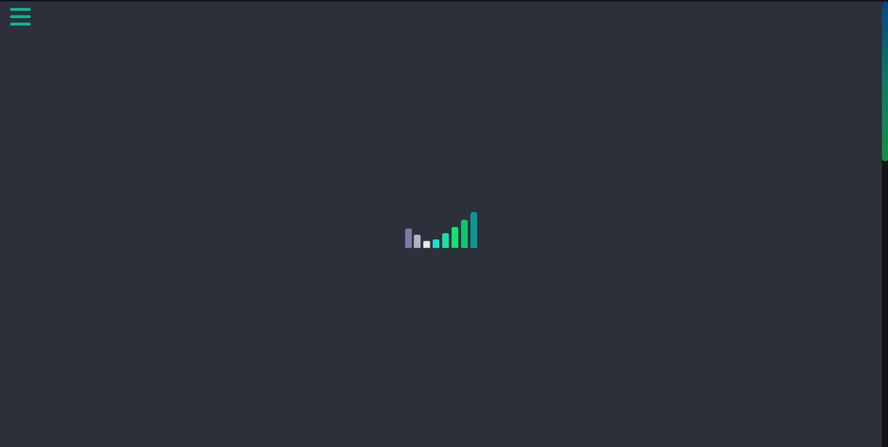
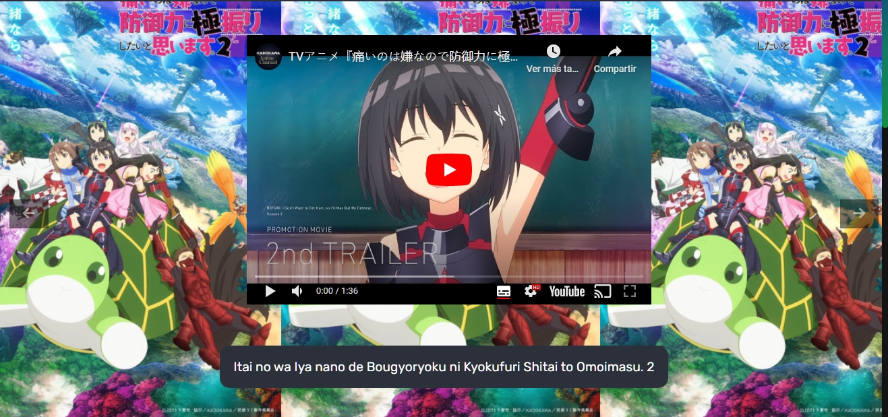
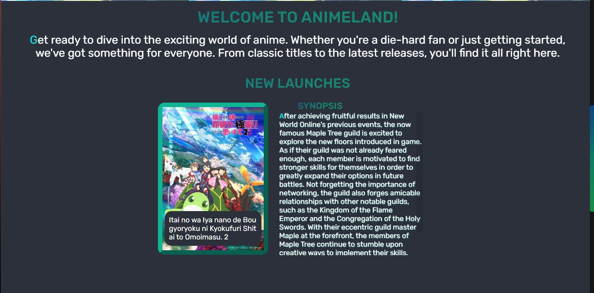

<h1 style="text-align:center;color:#1ADF61">Hello welcome<h1>

##### I made this page with api [<a href="">Jikan</a>](https://jikan.moe)

 

 

 # <landing-page-anime>
 #### This project is for practice and firm what I learned on the async course that platzi gave to his students.

 

 ## - Info about the page

 ##### ~~At the moment you can only search animes and is made for mobile more specific for screens that have 375 width and 667 height approximate, could work in screenshot higher than those but some things are gonna broke~~.
I made responsive almost all the mobile screens and some desktop. Also I made the landing page that's for now is the home page

 ## - Screenshot and a short video
 ##### This is how it looks the directory, probably in the future I'm gonna make some changes so at the moment is gonna stay like that
 
 #### The navbar is kind of fancy. I think, this is how it looks
 
 ## - A short video

### landing page 

##### the loader It looks similar on mobile screens

##### this section show seven new animes with their names and you can change doing click on the arrow (I put background-repeat: repeat-x because the background image lost too much quality)

##### The next section is more like an introduce and also show 24 pictures of new releases on 2023 with names and their synopsis(this change on mobile and only show the images)

### Thing to improve in the future

- ~~Change the dynamic html because I'm using innerHtml~~ 😐 (done)
- ~~make a footer for the page~~ (done)
- ~~make landing page~~ (done)
- ~~make a loader~~ (done)
###  Technologies that I used

- HTML
- CSS
- Javascript 
- AOS library

