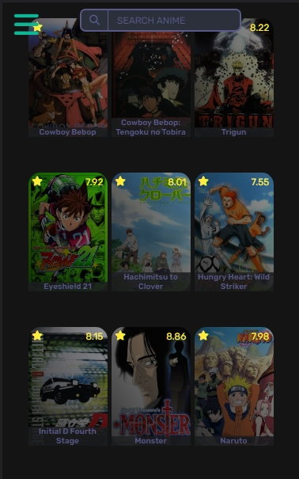
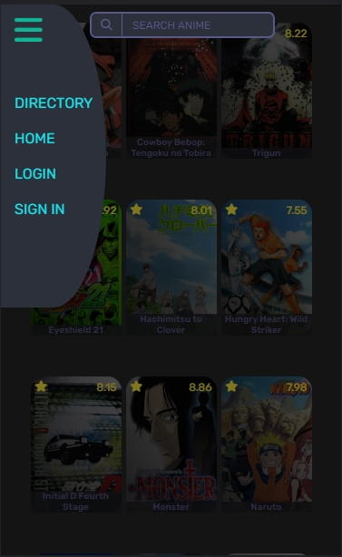

<h1 style="text-align:center;color:#1ADF61">Hello welcome<h1>

##### I made this page with api [<a href="">Jikan</a>](https://jikan.moe)

 

 

 # <landing-page-anime>
 #### This project is for practice and firm what I learned on the async course that platzi gave to his students.

 

 ## - Info about the page

 ##### At the moment you can only search animes and is made for mobile more specific for screens that have 375 width and 667 height approximate , could work in screenshot higher than those but some things are gonna broke.

 ## - Screenshot and a short video
 ##### This is how it looks the directory, probably in the future I'm gonna make some changes so at the moment is gonna stay like that
 
 #### The navbar is kind of fancy. I think, this is how it looks
 
 ## - A short video
<iframe width="560" height="315" src="https://www.youtube.com/embed/rf5XkO35pGo" title="YouTube video player" frameborder="0" allow="accelerometer; autoplay; clipboard-write; encrypted-media; gyroscope; picture-in-picture; web-share" allowfullscreen></iframe>

### Thing to improve in the future

- Change the dynamic html because I'm using innerHtml 😐
- Add a filter for search
- Add a pagination
- make a page for each anime
- make a footer for the page
- And add more features

###  Technologies that I used

- HTML
- CSS
- Javascript 

